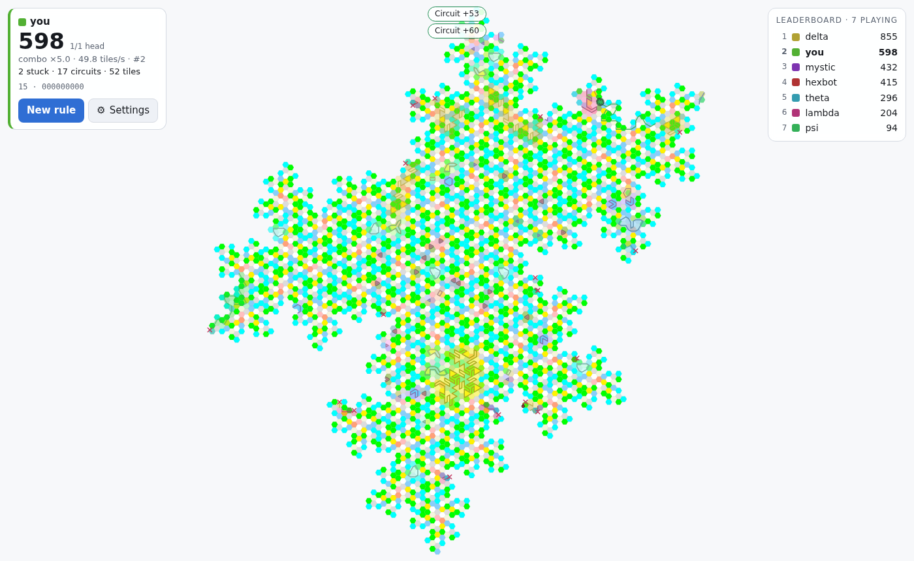
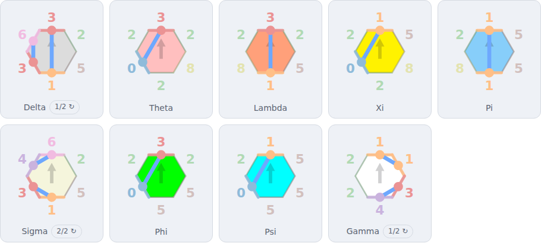
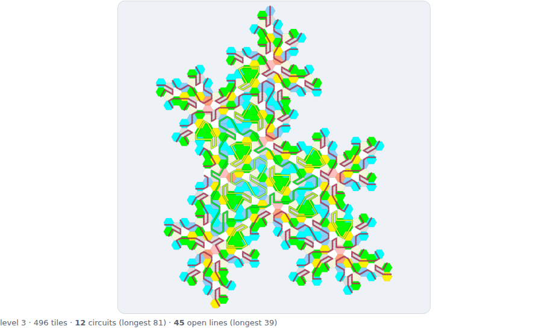
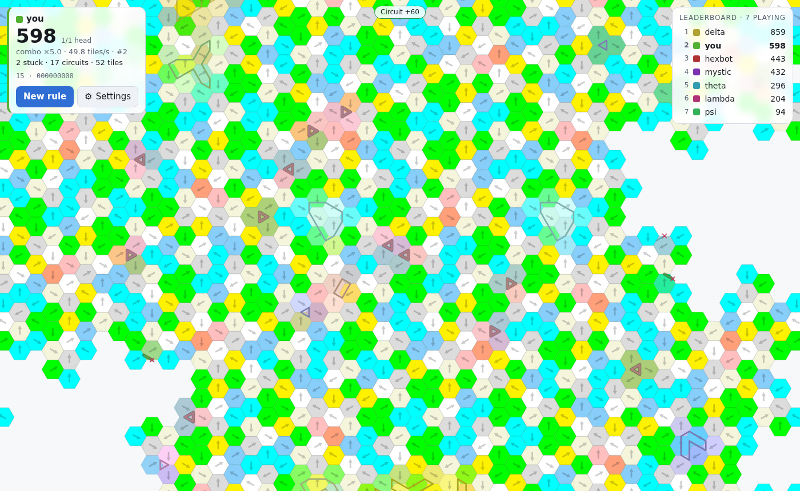
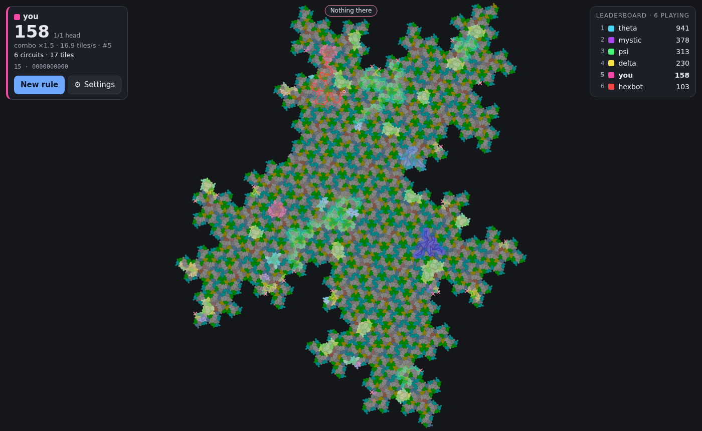
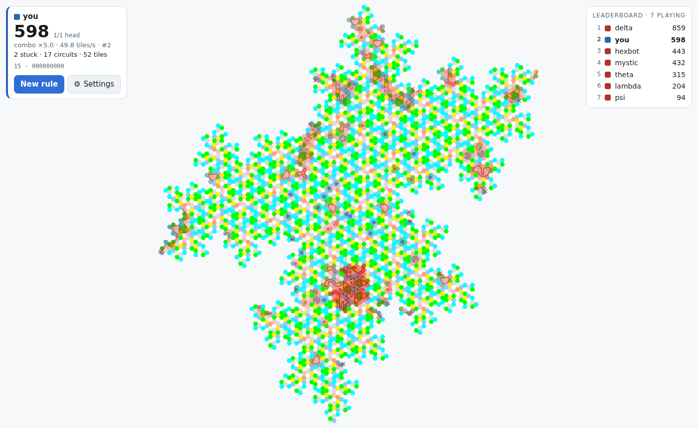
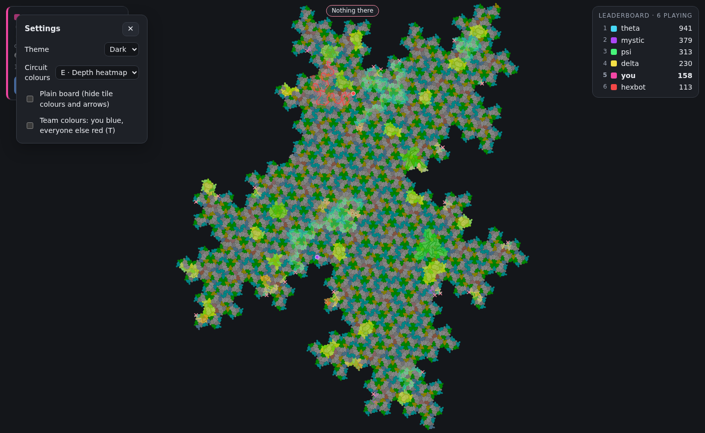
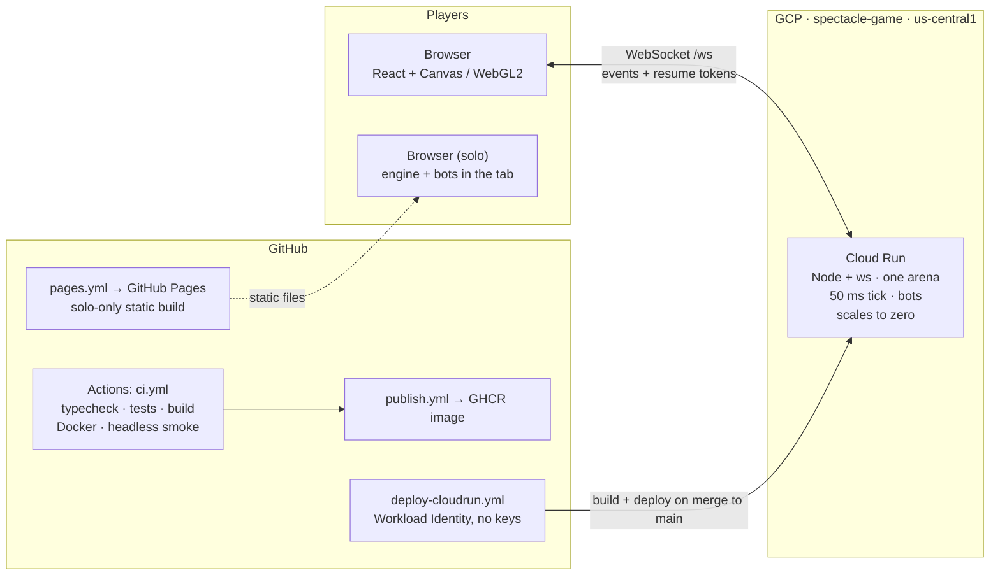

<div align="center">

# Spectacle

**A massively multiplayer strand-drawing game on hexagon and Spectre tilings.**

<h2>
  <a href="https://spectacle-iclxjyodzq-uc.a.run.app">▶&nbsp; Play the live arena</a>
</h2>

<a href="https://spectacle-iclxjyodzq-uc.a.run.app"></a>
&nbsp;
<a href="https://bohemian-miser.github.io/Spectacle/"></a>

<sub>Online: everyone on one shared field, bots included. Solo: the same engine and bots running entirely in your tab, no server.</sub>

<br><br>

<a href="https://spectacle-iclxjyodzq-uc.a.run.app"></a>

</div>

---

The [Spectre](https://github.com/bohemian-miser/Spectre) explorer's edge rules,
turned into an `.io`-style arena. Everyone shares one very large field of
tiles. You design your own **rule** — which edges carry a line, and how the
lines pair up inside each tile — then tap a tile. Your line grows from there on
its own, following *your* rule from tile to tile, faster the more you hold.
Close a loop and you score; run into a dead end and you stop; cross someone's
line and you both die.

## The game in 30 seconds

| | |
|---|---|
| 🧬 **Design a rule** | Switch edge classes on and drag dot to dot to pair them up inside each tile type. The preview shows the loops and loose ends your rule makes. |
| 👆 **Tap a tile** | Your line starts there and grows by itself, one tile per step, following your rule. Press-and-hold then drag to paint starts across an area. |
| ⭕ **Close circuits** | A line that comes back to where it began is a circuit: points for length and enclosed area, and your combo climbs. Run edge to edge and you claim the smaller side of the field. |
| ⚔️ **Cut and be cut** | Lines that cross both die, taking their points with them — scoring is zero-sum. You can't start on a rival's line; you have to grow into it. |
| 🏴 **Capture** | Close a circuit round a rival's line and you take their pattern (and every rival line inside). Each captured pattern is a new way to draw, and another head growing at once. |
| 🔍 **Discover** | Somewhere in the rule space are rules that draw one endless line. Nobody will tell you which. |

## Screenshots

<table>
<tr>
<td width="50%"></td>
<td width="50%"></td>
</tr>
<tr>
<td><b>The rule lab.</b> Every edge wears its class number; click one to switch that class on everywhere, drag dot to dot to pair lines up. Odd tiles are tails.</td>
<td><b>The preview.</b> A level-3 patch drawn with your rule: closed circuits coloured by length, open lines in red. <i>Surprise me</i> deals a random clean rule.</td>
</tr>
<tr>
<td></td>
<td></td>
</tr>
<tr>
<td><b>Up close.</b> Each hexagon's arrow says which way it is turned; your rule's pattern is sketched faintly on the tiles still free.</td>
<td><b>Spectre tilings, dark theme.</b> The same game on the aperiodic Spectre monotile — every tile type in the explorer's own colours.</td>
</tr>
<tr>
<td></td>
<td></td>
</tr>
<tr>
<td><b>Team colours</b> (press <kbd>T</kbd>): you in blue, everyone else in red.</td>
<td><b>Settings apply live</b> — theme, five circuit-colour styles, a plain board, team colours.</td>
</tr>
</table>

## Controls

| Action | Mouse | Touch | Keys |
|---|---|---|---|
| Start a line | click a tile | tap a tile | |
| Paint starts across an area | hold still ~0.3 s, then drag | hold, then drag | |
| Pan | drag · right/middle/shift-drag | drag · two fingers | |
| Zoom | wheel | pinch | |
| Pick the pattern you draw with | click a tab (bottom left) | tap a tab | <kbd>1</kbd>–<kbd>9</kbd> |
| Team colours | ⚙ Settings | ⚙ Settings | <kbd>T</kbd> |

## The rules in full

1. **Name and rule.** The lobby is the Tails-problem rule lab: every edge of
   every tile wears its class number (click one to switch that class on), and
   you draw the pairing by hand — drag dot to dot, click a dot to remove its
   line; lines never cross inside a tile. A level-3 patch underneath shows the
   circuits (coloured by length) and open lines the rule produces. Tiles with
   an odd number of lines are flagged as *tails* — your line will end there. *Surprise me* deals a
   random clean rule (one from the family's kernel, so every tile pairs up).
   The rules that draw one endless line exist; finding them is the game.
2. **Tap a tile.** It fades and takes your colour, and the chord nearest your tap
   starts growing out of one end, picked at random. Or **press and hold**
   (finger or mouse) for a moment, then drag: every tile you pass over becomes
   the next start, tapped as soon as you have a head free — sweep across an
   area you hold to keep filling it in. A plain drag pans (so do two fingers,
   or a right-, middle- or shift-drag); wheel or pinch zooms.
3. **It grows.** One tile per step; the step interval shrinks with your score
   (`baseStepMs / (1 + score × speedPerPoint)`, floored at `minStepMs`). Each tile
   entered scores `pointsPerTile`. Scoring is zero-sum: every line carries the
   points it earned, and when the line goes (cut, abandoned, capped) so do its
   points — your score is what you hold on the board. `stealFraction` hands a
   share of a cut line's points to the cutter (default 0).
4. **Circuits.** If the line arrives back at its first chord it closes. You get
   `combo × (circuitBase + lengthWeight × length + areaWeight × enclosedArea)`,
   and your combo multiplier steps up for the next one. Closed circuits stay on
   the board.
5. **Tails.** No continuation (an odd tile, a junction under `junctionPolicy:
   'stop'`, or the edge of the field) leaves the line stuck. You have one head
   at a time (`maxHeads`, default 1): a tap while your line is still growing is
   refused, and once it closes, sticks or dies you tap again to start the next.
   Nothing you drew is dropped until someone cuts it (`maxLivePaths` and
   `maxCompletedCircuits` cap this if you want; both default to unlimited).
   Lines block chords, not tiles: a tap on a tile a line already runs through
   starts on the nearest chord of it that no line is on or crosses. The one
   exception is a line of another of your patterns, which keeps its whole
   tile. Tapping the first chord of a line that ran off the edge of the field
   turns it round to grow out of its other end. A line that runs edge to edge cuts the
   field in two and closes like a circuit, claiming the smaller side (scored
   on that side's area).
   A growing line runs on over the top of your own lines rather than stopping,
   so start one off to the side and grow it in: layered lines are defence in
   depth — a rival has to cut each of them. If it meets one of your lines'
   loose ends on the same chord, the two join into one line (nothing is scored
   twice); two lines that each ran off the edge join into one edge-to-edge
   line and claim their side. `overlapOwnLines` off (`KNOB_OVERLAP_OWN_LINES=0`)
   is the older mode: a line that runs into your own stops there, and your own
   lines block only the chords they are on, like a rival's.
   Losing your head in a collision costs `respawnDelayMs` (500 ms) before the
   next tap lands.
6. **Crossing.** When a line enters a tile where another player's chord crosses
   it (proper intersection, or a shared connection point — both are knobs),
   both lines die — the one that was hit and the one that hit it — each with
   its points, and both combos reset (`mutualCut`; off makes it one-sided).
   You cannot *start* on a rival's line or inside a rival's closed circuit
   (`tapOntoOthers`, `tapInsideRivalCircuits`); you have to grow into them.
   Closed circuits take their colour from their length — short loops pale,
   long ones deep, the hue walking round from the owner's colour as they grow
   — and wash the tiles they enclose in it. The washes stack and each level of
   nesting sinks deeper, so a circuit inside a circuit stands apart.
7. **Capture.** Close a circuit round a rival's line and you take its pattern
   (the rule that drew it) — and the area is yours: every rival line wholly
   inside, loops and claims included, changes hands with the points it
   carries (`takeEnclosed`; off, they keep their lines). The pattern becomes yours to draw with,
   in a colour two thirds yours and one third theirs. Your patterns sit as
   tabs on the left wall, bottom left — the one sticking out furthest is
   active, and your next tap draws with it (click a tab, or press 1–9). Only
   the active pattern is sketched on the tiles no rival has touched (your own
   included). Holding a captured
   pattern also gives you a second head (`headsWithCapture`, default 2): two
   lines growing at once, from any mix of your patterns. Every further kind
   of line you capture adds another head, up to 12 (`headPerCapture`,
   `maxHeadsTotal`; `KNOB_HEAD_PER_CAPTURE=0` turns it off)
   (`captureOnEnclose`, `maxCapturedPatterns`, default 11).
8. **New rule** = restart: your lines and captured patterns go, and (by
   default) your score too.

**Which way a tile is turned.** Every hexagon in the arena is the same regular
hexagon, so nothing in its outline says which of the six rotations it is sitting
in — while its edge classes are numbered from edge 0 round. Zoom in and each one
wears a faint arrow pointing at that edge; the tiles in the rule lab wear the
same arrow, so their numbers can be read straight off the board. (A Spectre's
outline already shows its rotation, so it goes without.)

**The colours are Spectre's.** Every tile type wears the colour it has in the
[Spectre](https://github.com/bohemian-miser/Spectre) explorer's original table —
Xi yellow, the Gammas white, Pi sky blue, Phi green — on the board, in the rule
lab and in the patch preview alike, and the panels around them use the
explorer's tokens, so the two sites look like one.

**Settings.** The ⚙ button in the lobby header (and in the arena HUD) opens a
small panel; every change applies at once, behind it. **Circuit colours**
picks how loops and the areas inside them are shaded (A owner ramp, B length
palette, C depth bands, D contour stripes, E depth heatmap; `?circuits=a…e`
forces one). **Plain board** hides the tile colours and arrows, leaving the
arena's edge, the faint tile outlines when zoomed in and your rule's pattern.

**Light or dark** (also in Settings) flips the whole game, board included: outlines, the halo on your line and how far the
tiles are sat back are part of the scheme, not just the panels. Light shows the
tile colours as they are; dark dims them together — the hues never move — so the
strands on top still carry. Light is the default; your choice is remembered in
this browser, and `?theme=dark` / `?theme=light` forces one for a link or a
screenshot.

Every number above is a knob in [`shared/game/knobs.ts`](shared/game/knobs.ts);
set any of them with `KNOB_<NAME>` environment variables
(`KNOB_BASE_STEP_MS=250 KNOB_CROSSING_MODE=tile …`). Mechanics first, balance
later.

## Infrastructure



- **One authoritative server.** Node + [`ws`](https://github.com/websockets/ws)
  runs the engine on a 50 ms tick and broadcasts batched events. The field is
  deterministic from `(family, level, rootTile)`, so only that spec travels;
  clients draw lines from the event stream without knowing anyone's rule.
- **Cloud Run, scale to zero.** At most one instance, none when idle. The hourly
  WebSocket cap is invisible: the client reconnects and resumes the same player
  with a single-use token (kept for 5 minutes).
- **Keyless CI.** Every merge to `main` builds the image and deploys it through
  Workload Identity Federation pinned to this repository — there is no
  service-account key anywhere.
- **Pages.** The same engine and bots compiled into a static, solo-only build.
- **Alternative host.** A free `e2-micro` VM with Caddy (TLS) and Watchtower
  (auto-pull from GHCR) — see below.

## Running it yourself

```bash
npm install
npm run dev        # Vite client on :5173 (proxying /ws) + server on :8787 with 3 bots
```

Production: build the client and let the server serve it.

```bash
npm run build
PORT=8787 BOTS=1 npm start
# or
docker build -t spectacle . && docker run -p 8787:8787 -e BOTS=1 spectacle
```

Server environment:

| variable | default | meaning |
|---|---|---|
| `PORT` | `8787` | HTTP + WebSocket port |
| `FIELD_FAMILY` | `hex` | `hex` or `spectre` |
| `FIELD_LEVEL` | `6` | substitution level: hex 5 ≈ 31k tiles, 6 ≈ 242k; spectre 6 ≈ 273k |
| `FIELD_ROOT` | `Delta` | root tile of the patch |
| `BOTS` | `1` | bot players (random clean rules, occasionally aggressive) |
| `SEED` | random | RNG seed |
| `KNOB_*` | see knobs.ts | any gameplay knob |

`npm run bench:field` prints build time and size per level.

## Solo mode and GitHub Pages

The engine and the bots are plain shared code, so the whole game can run
inside one browser tab: pick *Solo, in this tab* in the lobby (or open
`/?solo`), choose the family, size and bot count, and play against bots with
nothing shared. The static build on GitHub Pages
(`.github/workflows/pages.yml`, published from `main`) is solo-only and links
to the live arena when the repository variable `SPECTACLE_ONLINE_URL` is set.
Enable Pages with the source set to *GitHub Actions* once in the repo settings.

## Hosting the online arena

The server is one always-on process while anyone is playing. Two GCP options
ship in `deploy/gcp/`; pick by what you want to pay for idle time.

**Cloud Run — scales to zero.** Run `PROJECT=<gcp project> ./deploy/gcp/setup-ci.sh`
once; it creates a deployer service account, a Workload Identity pool that only
this repo may use, and prints the GitHub variables to add. Nothing it prints is
secret — GitHub's OIDC token is swapped for a short-lived GCP one at deploy
time, so there is no key to leak or rotate. From then on every merge to `main`
builds the image and deploys it (`.github/workflows/deploy-cloudrun.yml`) —
nobody needs GCP credentials day to day, and the workflow is skipped until
`GCP_PROJECT` is set.
`./deploy/gcp/cloudrun.sh` does the same by hand from a laptop. Either way:
one instance at most, none when idle.
While people are connected you pay for one small instance; when the last one
leaves it is retired after about fifteen idle minutes, and idle costs nothing.
The free tier covers roughly fifty instance-hours a month. Cloud Run caps a
request, and so a WebSocket, at an hour; the client reconnects and resumes the
same player (`join.resume`, kept for `RESUME_GRACE_MS`, default 5 min), so
nobody notices. A page refresh does the same: the tab keeps its resume ticket
in `sessionStorage`, and the server rotates the token on every resume. Cold start is a few seconds for the first arrival.

**A free `e2-micro` VM — always on.** One `e2-micro` in `us-west1`,
`us-central1` or `us-east1` is in the always-free tier, so idle is free
anyway and there is nothing to scale down; it just keeps the arena warm.

1. Merges to `main` publish the image to `ghcr.io/bohemian-miser/spectacle`
   (`.github/workflows/publish.yml`). Make that package **public** once in the
   repo's Packages settings so the VM can pull it without credentials.
2. With `gcloud` logged in and a project selected:
   ```bash
   ./deploy/gcp/create-vm.sh                                  # HTTP on the VM's IP
   DOMAIN=spectacle.example.com ./deploy/gcp/create-vm.sh     # HTTPS via Caddy
   ```
   The startup script installs Docker, adds 1 GB of swap, and runs
   [`deploy/gcp/docker-compose.yml`](deploy/gcp/docker-compose.yml): the game,
   Caddy in front (TLS when a domain is set), and Watchtower, which pulls the
   new image within five minutes of a publish and restarts the game. A restart
   wipes the arena — fine for now, and the reason persistence is on the list.
3. Tune without redeploying: edit `/opt/spectacle/.env` on the VM (`BOTS`,
   `FIELD_*`, any `KNOB_*`), then `docker compose up -d` there.

Stop the VM: `gcloud compute instances stop spectacle --zone us-central1-a`.
Either way, egress beyond the free 1 GB/month is the only cost that scales
with players.

## How it is built

```
shared/tiles/   the Spectre core, vendored verbatim (geometry, families, seams,
                matchings, chords, kernel subsets) — runs identically in the
                server, the browser and the tests
shared/game/    field.ts     one finite patch: instances, vertex-neighbours, hit grid
                rule.ts      PlayerRule = (subset, matching), validation, random clean rules
                strand.ts    follow a strand tile to tile under a rule; conflict test
                engine.ts    the authoritative simulation (taps, ticks, circuits, cuts)
                knobs.ts     every tunable
                protocol.ts  wire types
server/         Node + ws: one arena, ticks the engine, broadcasts batched events,
                serves dist/. bots.ts is the opposition.
client/         Vite + React: lobby with the rule editor (interactive SVG
                tiles, level-3 preview), the arena — a WebGL2 instanced tile
                layer (Canvas2D fallback) under a Canvas2D strand overlay —
                tap/paint/pan/zoom and the HUD.
```

The server is authoritative and the field is deterministic from its spec, so a
client only ever receives the spec plus a stream of events (`step`, `wipe`,
`circuit`, `score`, …) with world-space geometry; it draws everyone's lines
without knowing everyone's rule.

Following a strand is purely local (the Infinite Map's tap-to-trace walk, per
player): a tile's chords depend only on its type and the rule, and consecutive
chords meet at a connection point on the shared seam. The unit tests pin this
walker against the Spectre core's global weld-and-trace (`analyze`) — the
circuits it finds walking from every chord are exactly the oracle's, on both
families.

## Tests

```bash
npm test                 # vitest: field, strand-vs-oracle, engine mechanics, rule validation
npm run typecheck
PW_EXE=/path/to/chromium npx tsx scripts/smoke.ts   # headless round against a running server
```

The README's screenshots come from `scripts/readme-shots.ts` (start a hex and a
spectre server with bots, then run it; the header of the script has the
commands) and live in `docs/images/`.

CI runs all three (the smoke job builds, starts the server with bots, plays a
round in Chromium and uploads screenshots).

## Next

- Tune the knobs (the point of having them): the score→speed curve currently
  rewards one long line heavily; circuit area vs length; wipe penalties.
- More than one live line, growing from both ends, or steering at junctions.
- A bigger field: the un-rooted engine from Spectre can make it effectively
  infinite; the renderer would go WebGL instanced as in the Infinite Map.
- Persistence, rooms/shards, spectating, a proper mobile layout.
